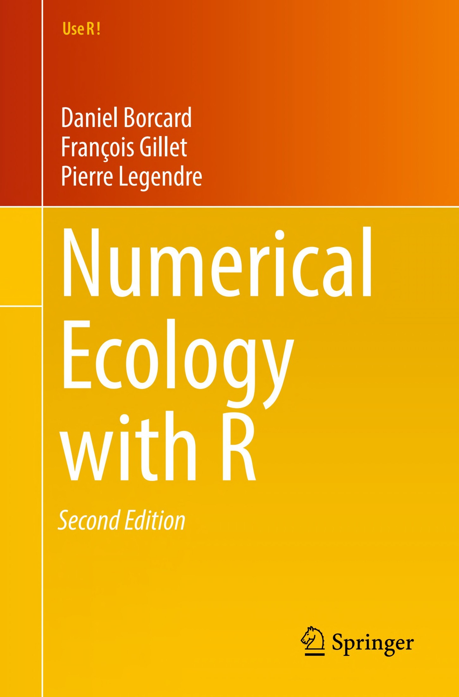
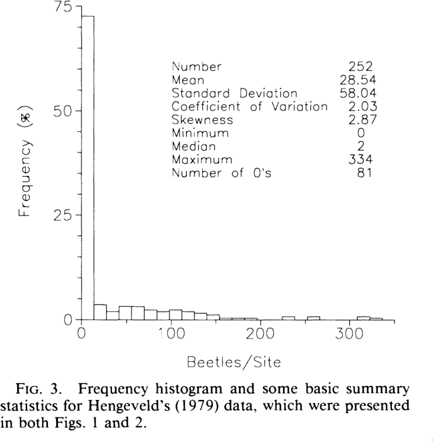

```{r knitr_setup, include=FALSE, cache=FALSE}

library(knitr)

### Chunk options ###

## Text results
opts_chunk$set(echo = FALSE, warning = FALSE, message = FALSE, eval = TRUE, size = "footnotesize")

## Code decoration
opts_chunk$set(tidy = FALSE, comment = NA, highlight = TRUE, prompt = FALSE, crop = TRUE)

# ## Cache
opts_chunk$set(cache = TRUE, cache.path = "knitr_output/cache/")

# ## Plots
opts_chunk$set(fig.path = "knitr_output/figures/")
opts_chunk$set(fig.align = "center")

### Hooks ###
## Crop plot margins
knit_hooks$set(crop = hook_pdfcrop)

## Reduce font size
# see http://stackoverflow.com/a/39961605
# knit_hooks$set(smallfont = function(before, options, envir) {
#   if (before) return(paste0("\n \\", options$size, "\n\n"))
#   else return("\n\n \\normalsize \n")
#   })
```

---

\center

\vspace{0.3cm}



---

\center

\vspace{0.3cm}


## O QUE VEREMOS

Tentando entender os padrões em comunidades ecológicas:


- UM PROBLEMA
<!-- Rossi1992 -->

- UMA SUGESTÃO
<!-- Legendre1993 -->

- UMA RUPTURA?
<!-- Chase and Hubbell -->

- UMA SOLUÇÃO?
<!-- Borcard1994, McIntire2009, Chase2014, Diniz-Filho2012 -->

- UM FINAL
<!-- O que podemos fazer agora -->


# UM PROBLEMA

## UM PROBLEMA

```{r, out.height = "80%"}

```

\center

Distribuição espacial da abundância de uma espécie

## UM PROBLEMA

```{r, out.height = "80%"}

```

\center

Distribuição espacial da fertilidade do solo

## UM PROBLEMA

```{r, out.height = "80%"}

```

\center

Distribuição espacial da precipitação

---

\center

\LARGE

Como separar esses efeitos?

## UM PROBLEMA^[Rossi *et al.* 1992, *Ecological Monographs*]

\begincols
\begincol

```{r, out.height = "70%"}

```

\endcol

\begincol


```{r, out.height = "70%"}

```

\endcol
\endcols

\vspace{1.0cm}

---

\center

\large

As estatísticas para os dois mapas anteriores são as mesmas

\vspace{0.5cm}

```{r, out.height = "90%"}

```

# UMA SUGESTÃO

## UMA SUGESTÃO

\center

Incorpore ao estudo aquilo que pode te ajudar a contar sua história^[Borcard *et al.* 1992, *Ecology*]

\vspace{0.5cm}

```{r, out.height = "40%"}

```

\small

Em outras palavras: abrace o problema!^[Legendre 1993, *Ecology*]

\vspace{1.0cm}

---

\center

\large

Pensando de forma operacional

\vspace{0.8cm}

```{r, out.height = "60%"}

```

\footnotesize

\center

\vspace{0.4cm}

Mas ainda precisávamos de uma teoria para o espaço

# UMA RUPTURA

## UMA RUPTURA

\center

O que está enraizado em nossas mentes há mais de um século^[Grinell 1917, *The Auk*]

\begincols
\begincol

**Nicho**:

- requerimentos ambientais
- relações intra e interespecíficas


\endcol

\begincol

```{r, out.height = "80%"}

```

\endcol
\endcols


## UMA RUPTURA

\begincols
\begincol

```{r, out.height = "80%"}
knitr::include_graphics("images/hubbell.jpg")
```

\center

Hubbell 2001

\endcol

\begincol

```{r, out.height = "80%"}

```

\center

Chase and Leibold 2003

\endcol
\endcols

---

\begincols
\begincol

\vspace{1cm}

```{r, out.height = "60%"}
knitr::include_graphics("images/chase-preface.png")
```

\center

\vspace{1cm}

Chase and Leibold 2003

\endcol

\begincol

<!-- \definecolor{hightlightColor}{HTML}{FFFF00} -->

\footnotesize

Hubbell (2001) recentemente desafiou ecólogos alegando que o conceito de nicho terá que ser completamente repensado a partir do primeiro princípio.

\vspace{0.5cm}

[...] todas espécies são, em essência, idênticas em seus nichos ecológicos.

\vspace{0.5cm}

[...] as ideias de Hubbell colocam a centralidade do conceito de nicho na ecologia em sério risco.

\endcol
\endcols

# UMA SOLUÇÃO

## UMA SOLUÇÃO^[Legendre *et al.* 2005, *Ecological Monographs*]

\begincols
\begincol

\vspace{0.5cm}

```{r, out.height = "70%"}

```

\vspace{0.5cm}

\endcol

\begincol

\small

**Múltiplas hipóteses**:

1. A composição de espécies é uniforme ao longo do espaço (interações preponderam)

2. A composição de espécies flutua aleatoriamente, mas com padrão espacial (dispersão prepondera)

3. A composição de espécies é relacionada ao ambiente (controle ambiental prepondera)


\endcol
\endcols

## UMA SOLUÇÃO^[Chase 2014 - **Spatial scale resolves the niche versus neutral theory debate**, *JVS*]

\vspace{0.5cm}

```{r, out.height = "80%"}

```

# UM FINAL

---

\center

\LARGE

Felizmente, não existe!

## UM FINAL

E ainda podemos (e devemos) explorar:

- Diversidade funcional

- Diversidade filogenética

- Estudos em múltiplas escalas espaciais

- Estudos em múltiplas escalas temporais

## UM FINAL

\small

> "O gerenciamento adequado dos ecossistemas, que geralmente são vistos pelos inquilinos do neoliberalismo como recursos para a indústria, exige que entendamos os processos pelos quais a diversidade é criada e mantida. Se a diversidade for inteiramente o resultado de processos aleatórios contemporâneos e históricos, podemos pegar os recursos em qualquer lugar sem efeitos adversos, desde que não os esgotemos. Caso contrário, temos que preservar a organização espacial ou as relações espécie-ambiente necessárias para a natureza recriar e manter a diversidade."^[Legendre *et al.* 2005, *Ecological Monographs*]


##  {.standout}

Obrigado!

<!--INÍCIO: NOTAS TÉCNICAS------------------------------------------------------

## notes

https://tex.stackexchange.com/questions/24599/what-point-pt-font-size-are-large-etc


Command             10pt    11pt    12pt
\tiny               5       6       6
\scriptsize         7       8       8
\footnotesize       8       9       10
\small              9       10      10.95
\normalsize         10      10.95   12
\large              12      12      14.4
\Large              14.4    14.4    17.28
\LARGE              17.28   17.28   20.74
\huge               20.74   20.74   24.88
\Huge               24.88   24.88   24.88

----FIM: NOTAS TÉCNICAS-------------------------------------------------------->
